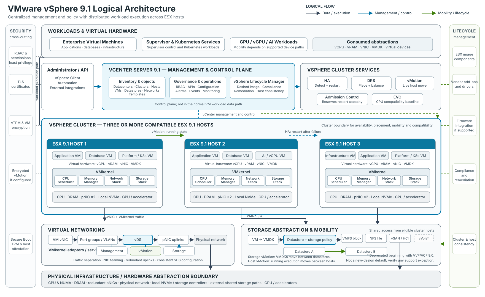

# VMware vSphere 9.1 Architecture: From Physical Hosts to a Resilient Enterprise Platform

VMware vSphere is often introduced as a hypervisor platform. That description is accurate, but incomplete. ESX virtualizes the resources of an individual server; vSphere turns many servers, networks, and storage systems into a coordinated operating environment for enterprise workloads.

The distinction matters. A single host can run virtual machines. A production platform must also maintain service through hardware failure, move workloads without planned downtime, enforce consistent configuration, control access, protect data, and support operations at fleet scale. Those outcomes come from the way ESX, vCenter, cluster services, networking, storage, lifecycle management, and security work together.

This article follows that architecture from the physical server upward and then examines the operational changes introduced with vSphere 9.1.

<aside class="article-callout" aria-label="Source and version note"><strong>Source and version note:</strong> The project reference PDF informed the sequence of topics and the core platform concepts. The article is original, and version-specific statements were independently checked against current Broadcom and VMware documentation as of September 2026. Feature availability can depend on product package, hardware compatibility, configuration, and patch level, so the release notes, compatibility guide, and product comparison remain the final authority for a specific deployment.</aside>

## Start with the product boundary

In the 9.x generation, Broadcom uses **VMware ESX** for the hypervisor name; some documentation and many practitioners still use **ESXi**. The current ESX should not be confused with the legacy, service-console-based product that ended with ESX 4.1.

There is also an important packaging boundary. Broadcom's current vSphere 9.1 FAQ states that 9.1 capabilities are available through VMware Cloud Foundation 9.1 and VMware vSphere Foundation 9.1. The standalone vSphere Standard and Enterprise Plus editions remain on version 8 Update 3 and earlier. Architects should therefore separate three questions that are often mixed together:

1. What does the vSphere compute layer do?
2. Which 9.1 capabilities are included in the selected platform offering?
3. Which capabilities are supported on the proposed server, device, firmware, and driver combination?

That separation prevents a sound technical design from being undermined later by an entitlement or compatibility assumption. The [vSphere 9.1 FAQ](https://www.vmware.com/docs/vsphere-9-1-faq), [version comparison](https://www.vmware.com/docs/vmw-version-comparison), and [Broadcom Compatibility Guide](https://compatibilityguide.broadcom.com/) should be part of the architecture evidence set, not procurement-stage afterthoughts.

## Physical infrastructure remains an architectural decision

Virtualization does not remove hardware constraints. It concentrates them.

CPU generation and NUMA topology influence VM sizing and scheduler behavior. Memory capacity sets the practical consolidation ceiling. NIC count and bandwidth affect how safely management, vMotion, storage, cluster, and workload traffic can coexist. Storage controllers, NVMe devices, firmware, drivers, and accelerators determine which features are supported and how maintenance can be performed.

For enterprise designs, I treat the following as first-class requirements:

- A server and device combination listed for the intended vSphere release and workload.
- Consistent firmware and driver baselines across each cluster.
- Redundant physical network paths, with switch configurations aligned to the virtual design.
- A failure-domain model that covers hosts, racks, power feeds, top-of-rack switches, storage paths, and sites.
- Capacity reserved for failures and maintenance, not only for average utilization.
- Out-of-band management that remains available when the production network is impaired.

These choices define what the software can safely automate. A cluster with three hosts connected through one physical switch is still exposed to a single network failure. A vMotion network without sufficient bandwidth can turn routine maintenance into a prolonged risk window. A GPU design built on unsupported device or firmware combinations can remove the mobility and lifecycle options that justified virtualization in the first place.

## ESX is the runtime and resource-control layer

ESX runs directly on the server and provides the VMkernel services that schedule CPU, manage memory, process storage I/O, switch network traffic, and control access to devices. Each virtual machine receives virtual hardware - vCPU, vRAM, virtual NICs, virtual controllers, firmware, and virtual disks - while ESX maps those abstractions to physical resources.

This model produces two operational benefits.

First, **isolation** limits the effect of a guest operating system or application failure. Isolation is not absolute security, and noisy-neighbor conditions remain possible when resources are poorly governed, but one VM does not own the physical server.

Second, **encapsulation** makes most of the VM state manageable as files and metadata. Configuration, virtual disks, firmware state, snapshots, and logs can be protected, replicated, cloned, or moved through platform workflows. A VM should still be treated as a running system with application consistency and data dependencies, not merely as a folder that can be copied safely at any time.

An ESX host can operate without continuous vCenter availability. Running workloads and established datastore connections do not stop simply because vCenter is offline. The loss of vCenter is still significant: centralized administration, many automation workflows, DRS decisions, lifecycle operations, inventory services, and new provisioning are affected. This is why the management plane needs its own backup, recovery, DNS, time, identity, and dependency design.

## vCenter is the control plane, not the workload data plane

vCenter turns individually useful hosts into a managed estate. It maintains inventory relationships, applies permissions, exposes APIs, collects events and alarms, coordinates cluster functions, manages distributed networking, and provides lifecycle workflows.

The control-plane distinction is important during failure analysis:

- If vCenter is unavailable, existing VMs normally continue to execute on ESX.
- If an ESX host fails, the VMs on that host stop and require a restart elsewhere unless a different protection mechanism, such as Fault Tolerance at an appropriate scope, is in use.
- If shared storage or the storage network fails, healthy compute hosts may still be unable to run affected VMs.
- If DNS, NTP, identity, certificates, or management networking are impaired, the servers may be healthy while platform administration is not.

Treat vCenter as critical infrastructure. Use supported file-based backup, protect the backup destination, document restore dependencies, and test recovery. A management appliance deployed on the same cluster it manages can be a valid design, but the team must understand how it will access and recover that appliance during a cluster, network, identity, or storage incident.

## VMware vSphere 9.1 Logical Architecture

The following diagram is a logical model of vSphere 9.1 responsibilities and traffic flows, not a VMware Cloud Foundation deployment topology. It separates centralized management and policy from the distributed execution path and uses a three-host cluster to make the relationships concrete.

<figure class="article-figure architecture-figure" id="vsphere-logical-architecture">
  
  <figcaption>Figure 1 — VMware vSphere 9.1 logical architecture showing the relationship between workloads, vCenter management, cluster services, ESX hosts, virtual networking, storage, security, lifecycle management, and physical infrastructure.</figcaption>
</figure>

The platform is easiest to understand as a set of cooperating layers:

- **Workloads** consume virtual hardware—vCPU, vRAM, vNICs, VMDKs, and virtual devices—rather than controlling physical resources directly.
- **vCenter Server** maintains inventory, permissions, configuration, monitoring, APIs, distributed-switch state, and lifecycle workflows. It coordinates the environment but does not forward normal VM traffic.
- **Cluster services** provide distinct functions: HA detects failure and restarts affected VMs; DRS evaluates placement and balance; vMotion moves running execution; Admission Control protects failover capacity; and EVC establishes a CPU-compatibility baseline where required.
- **ESX and the VMkernel** execute workloads and mediate access to CPU, memory, networking, storage, and accelerators on each host.
- **Virtual networking** maps VM and VMkernel connectivity through port groups and a vSphere Distributed Switch to redundant physical uplinks. Management, vMotion, storage, and workload traffic remain separate traffic classes even when they share physical adapters.
- **Storage** presents VMDKs through datastore abstractions backed by VMFS, NFS, or vSAN. Storage Policy-Based Management aligns supported storage capabilities with workload requirements.
- **Physical infrastructure** supplies the compute, memory, network, local-storage, shared-storage, and accelerator resources consumed by ESX.
- **Lifecycle and security controls** span the architecture. Desired images, compliance, and remediation maintain host consistency; identity, host trust, certificates, encryption, and protected migration address different security boundaries.

This is not a simple top-to-bottom dependency chain. HA relies on host agents, failure detection, accessible VM files, and sufficient restart capacity. DRS relies on vCenter telemetry, compatible destinations, and vMotion. Distributed switching still depends on correctly configured physical VLANs, MTU, and redundant paths. The platform's reliability comes from these relationships, not from any single feature.

The diagram includes vVols only to acknowledge inherited environments. Broadcom's current [vSphere version comparison](https://www.vmware.com/docs/vmw-version-comparison) does not list vVols for 9.x, and its [support notice](https://knowledge.broadcom.com/external/article/401070) says the capability is deprecated beginning with VVF and VCF 9.0. It should not be treated as a default storage choice for a new 9.1 design; any existing use requires an explicit, verified support and migration path.

### How the Components Interact

#### 1. VM execution flow

**Application → guest operating system → virtual hardware → VMkernel → physical CPU, memory, NICs, storage, or accelerators.**

The guest sees stable virtual devices. The VMkernel schedules CPU time, manages memory, processes network and storage I/O, and enforces access to physical devices. This abstraction allows workloads to be placed and operated independently of a specific server while keeping hardware access under the hypervisor's control.

#### 2. Management flow

**Administrator or automation → vSphere Client or API → vCenter Server → cluster, ESX hosts, and managed objects.**

vCenter applies policy and coordinates configuration, placement, lifecycle, permissions, alarms, and inventory. Management commands reach host agents and managed objects over the control plane. Normal VM application traffic does not traverse vCenter, which is why running VMs can continue when vCenter is temporarily unavailable even though centralized operations are impaired.

#### 3. vMotion flow

**Running VM on Host A → dedicated logical vMotion path → compatible Host B → execution resumes on the destination.**

During a host vMotion, ESX transfers active execution state over VMkernel networking while the workload remains running; in a classic shared-storage migration, both hosts continue to access the same datastore. **Storage vMotion is different:** it moves the VM's virtual disks between datastores. Supported workflows can combine compute and storage migration, but the two operations solve different problems and have different data paths.

#### 4. Storage flow

**VM → VMDK → datastore and storage policy → VMFS, NFS, or vSAN implementation → physical or distributed storage resources.**

The datastore gives ESX hosts a consistent consumption model while the underlying implementation supplies capacity, protection, and performance. Shared accessibility is critical for classic vMotion and HA restart. Snapshots and clones are platform operations on VM state; they do not replace application-consistent backup, retention, or disaster recovery.

## The cluster is the practical unit of resilience

A vSphere cluster groups compatible ESX hosts so that capacity and workload state can be managed collectively. The cluster is where several commonly confused functions meet.

### HA restores service after a failure

vSphere High Availability monitors host and VM health and can restart affected VMs on surviving hosts. This is **restart-based recovery**, not zero-downtime continuity. The application experiences an interruption while failure is detected, placement is selected, the VM is powered on, and the guest and application recover.

HA also depends on capacity and accessibility. Surviving hosts need enough CPU and memory, compatible networking, and access to the VM's configuration and disks. Admission control protects restart capacity from being consumed during normal operations. Disabling or weakening it may increase steady-state utilization, but it also reduces the assurance that protected VMs can restart when a host fails. Broadcom's HA guidance confirms that failover can fail when resources or datastore visibility are insufficient.

### DRS improves placement and resource availability

Distributed Resource Scheduler evaluates whether each VM has suitable compute resources and recommends or initiates placement changes. It can select an initial host at power-on and use vMotion to correct resource contention as demand changes.

DRS is not an availability mechanism. It assumes the participating hosts are operating and that compatible migration targets exist. HA asks where a VM can restart after failure; DRS asks where a running VM can receive an appropriate resource allocation.

Affinity and anti-affinity rules, reservations, limits, shares, licensing boundaries, device assignments, and maintenance state all influence placement. Mandatory rules should be used carefully because they can prevent DRS movement or HA restart when the remaining cluster cannot satisfy them.

### vMotion provides planned mobility

vMotion transfers a running VM's execution state between compatible hosts. The typical flow copies memory while the VM runs, tracks changed pages, briefly quiesces execution for final state transfer, and resumes the VM on the destination. Standard host migration can leave the virtual disks on shared storage. Storage vMotion moves virtual disks between datastores, and supported combined migrations can move compute and storage together.

vMotion is an operational tool, not a backup or disaster-recovery strategy. It is valuable for maintenance, DRS balancing, hardware evacuation, and some migration scenarios, but it does not preserve a recoverable historical copy. A source that has already failed cannot participate in a live migration.

The practical lesson is to design HA, DRS, and vMotion together but assign each one a precise responsibility: **restart, place, and move**.

## Networking connects every control and failure domain

vSphere networking provides software switching between virtual NICs, VMkernel adapters, and physical uplinks. A vSphere Standard Switch is configured per host. A vSphere Distributed Switch centralizes switch and distributed port-group configuration through vCenter and applies a consistent model across participating hosts. Broadcom's [distributed-switch overview](https://knowledge.broadcom.com/external/article/324515) documents that distinction.

The virtual switch is only part of the path. End-to-end behavior also depends on physical switch ports, VLAN trunks, MTU, routing, link aggregation where used, upstream redundancy, firewall policy, and name and time services.

A production design should explicitly address separate traffic classes:

- Management and host administration.
- VM workload networks.
- vMotion.
- Storage traffic such as NFS, iSCSI, NVMe over Fabrics, or vSAN.
- Cluster and platform services where applicable.
- Backup, replication, and out-of-band operations.

Separation can be physical, logical, or both. The right design depends on bandwidth, risk, and scale, but each class needs clear security policy, quality-of-service assumptions, redundancy, observability, and failure testing. VLAN separation without capacity engineering does not prevent backup traffic from congesting vMotion. NIC teaming without upstream diversity does not remove a switch failure. A consistent distributed-switch configuration does not correct a mismatched physical MTU.

## Storage architecture determines VM durability and mobility

Most VM virtual disks are stored as VMDK objects presented through datastores. The datastore is a logical consumption boundary; the durability and performance come from the storage system, network paths, protection policy, and operational processes beneath it.

Common approaches include:

- **VMFS** on block storage such as Fibre Channel, iSCSI, or supported NVMe-oF configurations.
- **NFS** datastores supplied by a NAS platform.
- **vSAN**, which aggregates supported host-local devices into distributed cluster storage.
- Storage-policy-based management, which expresses workload requirements and applies them through supported storage capabilities.

The architecture should be driven by workload requirements rather than protocol preference. Evaluate latency, throughput, IOPS, availability, failure-domain behavior, rebuild impact, snapshot and replication integration, backup support, encryption, operational skill, and growth.

Be especially careful with inherited designs. Broadcom's current [vSphere version comparison](https://www.vmware.com/docs/vmw-version-comparison) does not list Virtual Volumes for version 9.x. A team using vVols in an earlier release should verify current support statements and migration requirements before treating an upgrade as routine.

Storage policy does not remove the need to understand failure behavior. A policy may request a protection level, but the physical design must have enough independent capacity and fault domains to satisfy it. Similarly, HA can restart a VM only if a surviving host can access a valid copy of its files or objects.

## Lifecycle management is configuration management for the hypervisor fleet

Cluster reliability depends on hosts being predictably similar. Drift in ESX builds, vendor add-ons, drivers, firmware, security settings, or distributed-switch configuration creates operational uncertainty and can narrow the set of valid failover and migration targets.

vSphere Lifecycle Manager addresses the software image side through a desired-state model. An image can include the ESX base image, an optional vendor add-on, and supported firmware and driver integration. Hosts are checked against that target and remediated to return them to compliance. Broadcom's [vSphere Lifecycle Manager overview](https://www.vmware.com/docs/introducing-vsphere-lifecycle-management-vlcm) describes the declarative model and its purpose: reducing variation across cluster members.

For version 9.x, image-based lifecycle management is the design center; the older baseline-managed approach is no longer a valid default to carry forward. The operational workflow should include compatibility checks, pre-remediation health checks, evacuation capacity, maintenance sequencing, rollback planning, and evidence that application owners accept the maintenance behavior.

vSphere 9.1 adds several useful controls:

- Exported Lifecycle Manager image definitions include a SHA-256 checksum. Broadcom explicitly notes that this validates the **image definition**, not every ESX package binary.
- Lifecycle Manager can report driver and firmware information and perform first-level HCL validation for vSAN devices without a third-party Hardware Support Manager, although some devices still need vendor integration to report firmware.
- Configuration Profiles can apply cluster desired state, including parts of distributed-switch configuration and memory-tiering setup.
- Zero Touch Provisioning builds on Auto Deploy with UEFI HTTP/S boot and can bring a new host toward the selected cluster image and configuration.
- Live Patch is enabled by default for capable patches, supports TPM-enabled hosts in 9.1, and otherwise falls back to the normal maintenance-mode and reboot workflow unless the policy is set to enforce live-patch-only remediation.

The last point deserves emphasis: not every patch is live-patch capable. Maintenance capacity and reboot procedures remain part of a responsible design.

## Security is a chain of trust and operating controls

No single checkbox makes a virtual platform secure. The control set must extend from boot firmware to administrator identity and workload data.

### Establish host trust

Secure Boot validates signed boot components. A physical TPM can protect keys and record measurements used for host attestation. These controls help detect or prevent unauthorized changes to the host boot chain, but they do not replace firmware governance, restricted management access, or patching.

A virtual TPM serves a different purpose: it exposes TPM functionality to a guest VM, often for guest operating system features such as measured boot or credential protection. Physical TPM and vTPM should not be treated as interchangeable controls.

### Control administrative access

Central identity, role-based access control, least privilege, separation of duties, and auditable administrative paths should govern vCenter and ESX. Service accounts need the same lifecycle discipline as human accounts. Direct host access and SSH should be restricted, monitored, and reserved for defined break-glass or support workflows.

### Protect data and movement

VM encryption can protect VM configuration and virtual disks through a supported key provider. Encrypted vMotion protects migration traffic. These capabilities do not replace application-level encryption, database controls, secrets management, or backup encryption; they address different threat surfaces.

Certificates also need ownership. In 9.1, VMCA-managed vCenter and ESX TLS certificates can renew automatically within documented thresholds. Certificates issued by an external certificate authority are not automatically renewed by that mechanism and remain an operator responsibility.

### Treat security features as entitlement- and dependency-sensitive

Version 9.1 introduces or expands capabilities such as file-integrity monitoring, a supported framework for third-party EDR integration on ESX, and confidential computing options. Broadcom's FAQ notes that some security capabilities require the VMware Advanced Cyber Compliance offering. Hardware support, key management, guest support, operational tooling, and product entitlement should all be validated before these controls are placed in a compliance architecture.

Broadcom's [VCF 9 security overview](https://blogs.vmware.com/cloud-foundation/2025/08/05/security-vmware-cloud-foundation-9-0/) also documents the removal of several legacy components and reinforces a useful design principle: reducing obsolete management paths is itself a security improvement.

## Modern workloads use the same foundation but not the same operating model

vSphere can support conventional VMs, Kubernetes services, and accelerator-dependent AI or data workloads. Sharing a platform does not mean treating those workloads identically.

The vSphere Supervisor provides a control-plane layer for infrastructure services, while VMware vSphere Kubernetes Service (VKS) enables consumers to declaratively create and manage Kubernetes clusters. The official [VKS API documentation](https://developer.broadcom.com/xapis/vmware-vsphere-kubernetes-service/latest/) describes Cluster API-based management of topology, node pools, VM classes, storage policies, networking, scaling, upgrades, and health.

This creates a common infrastructure substrate, but architects still need to define:

- Namespace, identity, quota, and tenancy boundaries.
- Container image, registry, supply-chain, and secrets controls.
- Load-balancing, ingress, DNS, and network-policy design.
- Persistent-volume protection, backup, and recovery.
- Ownership between virtualization, platform-engineering, security, network, and application teams.
- Upgrade compatibility between the Supervisor, VKS releases, add-on services, and application clusters.

AI and accelerator-backed workloads add another set of trade-offs. Direct device assignment can improve performance while restricting mobility or changing failure behavior. Enhanced DirectPath I/O and vGPU capabilities preserve more virtualization operations for supported devices, but support is device-, vendor-, firmware-, guest-, and configuration-specific. The architecture should begin with the required mobility, isolation, sharing, performance, and recovery outcomes, then choose the attachment model.

## What vSphere 9.1 changes in operational terms

The most relevant 9.1 changes are not isolated features; they alter how teams plan capacity, maintenance, and specialized workloads. Broadcom's [vSphere 9.1 overview](https://blogs.vmware.com/cloud-foundation/2026/05/12/whats-new-with-vsphere-9-1/) and [general FAQ](https://www.vmware.com/docs/vsphere-9-1-faq) provide the authoritative release-level descriptions.

| vSphere 9.1 change | Architectural or operational implication |
| --- | --- |
| vCenter Quick Patch | Security patches marked as quick-patch compatible update only changed components, reducing control-plane interruption. This is not a promise that every vCenter update is zero-downtime. |
| Expanded ESX Live Patch | More eligible host patches can be applied without the normal evacuation and reboot cycle, including on TPM-enabled hosts. Clusters still need capacity and procedures for non-eligible patches. |
| Enhanced NVMe memory tiering | Local NVMe can extend the logical memory available to VMs while ESX manages page placement between DRAM and NVMe. Version 9.1 adds simpler configuration, device-health visibility, and optional software mirroring. Workload qualification and device endurance remain essential. |
| Topology-aware scheduling | The scheduler considers CPU contention together with cache and memory-bandwidth conditions on modern NUMA systems. Large VMs and asymmetric topologies benefit only when VM sizing and hardware layout are understood. |
| Improved vMotion batching and evacuation | A new migration can begin as soon as a batch slot becomes free, and DRS can avoid maintenance evacuation when destination capacity would create contention. Network and destination capacity still set the practical limit. |
| Intel QAT offload for encrypted vMotion | Supported Intel QAT hardware can offload encryption work and return CPU cycles to workloads. This is a hardware-dependent optimization, not a reason to relax vMotion security. |
| Broader Enhanced DirectPath I/O support | More supported accelerators can retain useful VM operations and mobility characteristics. Compatibility must be validated for the exact device and workflow. |
| Zero Touch Provisioning and Configuration Profiles | New hosts can be bootstrapped toward a cluster's desired image and configuration with less manual work. DHCP or static UEFI boot configuration, management-network reachability, trust, and recovery paths still need design. |

I would not build a business case around a headline benchmark or maximum consolidation ratio. Memory access patterns, NUMA behavior, storage latency, accelerator usage, and operational constraints vary too widely. Use Broadcom guidance to identify candidate features, then validate them with representative workloads, failure tests, and an agreed performance baseline.

## A practical architecture and operations checklist

Before approving a vSphere 9.1 design, I would expect clear answers to the following questions.

### Service objectives and failure model

- Which workloads are protected by HA, application clustering, replication, backup, or Fault Tolerance?
- What RTO and RPO does each mechanism actually support?
- Which failures are contained at host, rack, storage, network, and site level?
- Does admission control preserve enough restart capacity during both failure and maintenance?

### Management plane

- How are vCenter, DNS, NTP, identity, certificate, key-management, and backup dependencies protected?
- Can operators recover vCenter when normal centralized management is unavailable?
- Are direct-host and break-glass procedures controlled, current, and tested?

### Compute and mobility

- Are cluster members compatible enough for HA placement and vMotion?
- Are EVC, NUMA, affinity rules, reservations, and accelerator assignments intentional?
- Can the cluster evacuate one host without creating unacceptable contention?

### Network and storage

- Are management, vMotion, storage, workload, backup, and replication paths sized and observed independently?
- Do virtual and physical VLAN, MTU, teaming, routing, and security settings agree end to end?
- Can every potential HA target access the required VM storage?
- Are storage policies, replication, backup, and restore behavior tested rather than assumed?

### Lifecycle and security

- Is every cluster managed against an approved image and configuration state?
- Are firmware, drivers, ESX builds, and hardware compatibility evaluated together?
- Which patches qualify for quick or live patching, and what is the fallback maintenance process?
- Who owns identity, RBAC, certificates, keys, logging, vulnerability response, and security exceptions?

### Modern workloads

- Who operates the Supervisor, VKS clusters, networking, registries, persistent data, and upgrades?
- Which accelerator attachment model meets the required performance and mobility objectives?
- Have platform teams tested failure, evacuation, backup, and recovery for Kubernetes and AI workloads, not only conventional VMs?

## The architectural lesson

The enduring value of vSphere is not that it can divide one server into many virtual machines. It is that it can turn a compatible fleet into a governed workload platform with consistent mechanisms for placement, recovery, mobility, lifecycle, and security.

That outcome is not automatic. HA cannot compensate for missing restart capacity. DRS cannot correct an undersized cluster. vMotion cannot replace backup. A distributed switch cannot repair the physical network. Encryption cannot fix weak identity governance. Kubernetes support does not create a platform operating model by itself.

vSphere 9.1 improves maintenance, scheduling, memory utilization, encrypted mobility, provisioning, and accelerator support. The practical benefit appears when those capabilities are integrated into a design with explicit failure domains, measurable service objectives, supported hardware, disciplined lifecycle management, and tested recovery.

That is the difference between installing a hypervisor and engineering an enterprise platform.

## References

1. VMware by Broadcom, [vSphere with VCF 9.1 General FAQ](https://www.vmware.com/docs/vsphere-9-1-faq), May 2026.
2. VMware by Broadcom, [VMware vSphere 9.1 Version Comparison](https://www.vmware.com/docs/vmw-version-comparison), 2026.
3. VMware Cloud Foundation Blog, [What's New with vSphere in VMware Cloud Foundation 9.1?](https://blogs.vmware.com/cloud-foundation/2026/05/12/whats-new-with-vsphere-9-1/), May 12, 2026.
4. Broadcom TechDocs, [What's New in VMware Cloud Foundation 9.1 - vSphere](https://techdocs.broadcom.com/us/en/vmware-cis/vcf/vcf-9-0-and-later/9-1/release-notes/vmware-cloud-foundation-9-1-0-0-release-notes/what-s-new/whats-new-vsphere.html).
5. VMware Cloud Foundation Blog, [Rapid Patching of VMware vCenter in VMware Cloud Foundation 9.1](https://blogs.vmware.com/cloud-foundation/2026/05/12/vcenter-quick-patch/), May 12, 2026.
6. VMware Cloud Foundation Blog, [Advanced Memory Tiering Enhancements in VMware Cloud Foundation 9.1](https://blogs.vmware.com/cloud-foundation/2026/05/07/advanced-memory-tiering-enhancements-in-vmware-cloud-foundation-9-1/), May 7, 2026.
7. VMware Cloud Foundation Blog, [Performance Best Practices for VMware vSphere 9.1](https://blogs.vmware.com/cloud-foundation/2026/07/13/performance-best-practices-for-vmware-vsphere-9-1/), July 13, 2026.
8. VMware by Broadcom, [Introducing vSphere Lifecycle Management](https://www.vmware.com/docs/introducing-vsphere-lifecycle-management-vlcm).
9. Broadcom Knowledge Base, [Overview of vNetwork Distributed Switch Concepts](https://knowledge.broadcom.com/external/article/324515).
10. Broadcom Knowledge Base, [Determining Why and Which Virtual Machines Were Restarted During a vSphere HA Failover](https://knowledge.broadcom.com/external/article/316525).
11. Broadcom Knowledge Base, [Impact of Permanent vCenter Server Loss on ESXi Datastore Connectivity](https://knowledge.broadcom.com/external/article/441288).
12. Broadcom Developer Portal, [VMware vSphere Kubernetes Service API Documentation](https://developer.broadcom.com/xapis/vmware-vsphere-kubernetes-service/latest/).
13. VMware Cloud Foundation Blog, [Security in VMware Cloud Foundation 9.0](https://blogs.vmware.com/cloud-foundation/2025/08/05/security-vmware-cloud-foundation-9-0/), August 5, 2025.
14. VMware by Broadcom, [VMware vSphere 9.1 Product Line Comparison](https://www.vmware.com/docs/vmw-datasheet-vsphere-product-line-comparison), 2026.
15. Broadcom, [VMware Hardware Compatibility Guide](https://compatibilityguide.broadcom.com/).
16. Broadcom Knowledge Base, [Creating a vSphere DRS and HA Cluster](https://knowledge.broadcom.com/external/article/308413).
17. Broadcom Knowledge Base, [Deprecation of VMware vSphere Virtual Volumes in VCF 9.0 and VVF 9.0](https://knowledge.broadcom.com/external/article/401070).
